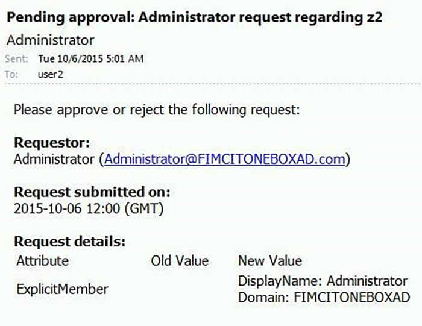

# FIM の問題と解決方法
## Forefront Identity Manager 問題と解決方法
### 懸案事項の一覧
[通知を要求でユーザー属性](#issue--user-attributes-in-request-notifications)
[別の問題](#another-issue)

### 通知を要求の問題: ユーザーの属性
グループにユーザーを追加する要求を行ったユーザーとグループの所有者はその要求を承認するかを確認する FIM で生成された電子メールを受け取ります。 受信者は、FIM は既定では、新しいメンバーの表示名だけを送信するため、要求を承認する必要があるかどうかを判断できません。 表示名が"Administrator"の例については、一意ではありません。   ユーザー アカウントのドメインなど、電子メールの要求で多くの属性が必要です。

### 解決方法: 属性値を追加します。
承認と通知の電子メールで電子メール テンプレートに含めることによって要求された変更の属性値を電子メール メッセージの本文で送信できます。

-  フィールド `[//RequestParameter/AllChangesAuthorizationTable]` である場合、 *承認* ワークフローまたは
- フィールド `[//RequestParameter/AllChangesActionTable]` にある場合、 *アクション* ワークフローです。

参照値の属性に値を追加する、要求元が要求した場合 (例:、グループの属性の値として、ユーザーへの参照を追加する)、通常 1 行のみが、テーブルに含まれ、その行には、要求されたリンク オブジェクト (ユーザーの名前など) の表示名が含まれています。   

参照されるオブジェクトのさまざまなやその他の属性は、電子メールに含めるか、これらの属性のシステム名は、電子メール通知テンプレートでは、このフィールドに含まれるできます。  たとえば、 `[//RequestParameter/AllChangesAuthorizationTable,”Domain”,”AccountName”,”DisplayName”]`

## 問題: 別の問題
具体的な例を示します
## 解決方法: 別のソリューション
書き留めた de な例を示します

<!--HONumber=Mar16_HO1-->

